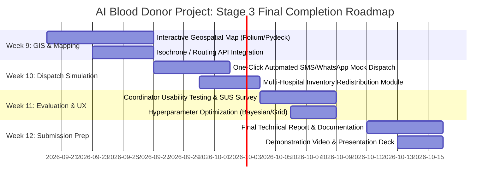

# 🩸 General Sir John Kotelawala Defence University (KDU)
## Faculty of Computing — Department of Computer Science & Software Engineering
### Semester 4 Group Project: Artificial Intelligence (AI) — Stage 2 Progress Review

---

| **Document Title** | **Stage 2 Progress Review: AI-Based Emergency Blood Donor Recommendation System** |
|---|---|
| **Module Code & Name** | CS4002 / SE4002: Artificial Intelligence & Machine Learning Group Project |
| **Academic Year / Semester** | Year 2 / Semester 4 (SEM 4) |
| **Submission Milestone** | Stage 2: Progress Review (Week 8) |
| **Assessment Weight** | 10% |
| **Team Size** | 4 Members |
| **Date of Submission** | September 2026 |

---

# Executive Summary

During acute clinical emergencies (e.g., severe trauma, obstetric hemorrhage, major surgical transfusions), conventional blood banking systems often suffer from significant operational friction. Static, unranked donor registries force medical coordinators to contact donors sequentially without predictive insights into geographic proximity, real-time availability, safe donation intervals, or response likelihood.

To solve this challenge, our team is developing the **AI-Based Emergency Blood Donor Recommendation and Prioritization Decision-Support System**. The system implements a **Three-Pillar AI Architecture**:
1. **Deductive AI (Rule-Based Reasoning)**: Enforces non-negotiable serological compatibility rules (ABO & Rh red blood cell matching) and clinical safe donation intervals (minimum 90-day recovery period).
2. **Predictive AI (Machine Learning Classification)**: Employs a tuned **Random Forest Classifier** (benchmarked against Logistic Regression and Decision Trees) to predict the probability of affirmative emergency response ($P(\text{Response}) = 96.2\%$ recall, $0.9486$ ROC-AUC).
3. **Decision & Explainable AI (Multi-Criteria Optimization & XAI)**: Ranks eligible donors using a normalized multi-criteria weighting formulation (40% Response Probability + 30% Availability + 20% Proximity + 10% Donation History) and generates natural-language, evidence-based rationales for transparency.

This document presents the Stage 2 Progress Review, outlining updates made following proposal feedback, finalized AI designs, dataset architecture, partial implementation outputs, challenges overcome, and the roadmap toward the final Stage 3 submission.

---

## 1. Updated Project Title and Problem Statement

### 1.1 Updated Project Title
> **"AI-Powered Emergency Blood Donor Recommendation and Prioritization Decision-Support System with Explainable AI (XAI)"**

*Note on refinement*: The title was updated from the initial proposal (*"Blood Donor Matching System"*) to explicitly emphasize the **emergency triage decision-support focus**, the **multi-criteria prioritization mechanism**, and the inclusion of **Explainable AI (XAI)**.

---

### 1.2 Problem Statement
In emergency medicine, rapid access to compatible blood is critical to patient survival. However, existing blood bank registries and emergency coordination protocols face severe operational and technological bottlenecks:

```
+---------------------------------------------------------------------------------------------------+
|                                 CONVENTIONAL SYSTEM BOTTLENECKS                                   |
+---------------------------------------------------------------------------------------------------+
| 1. Static Unranked Registries: Coordinators dial numbers alphabetically or in FIFO order.        |
| 2. Geographic Blindness: Donors located 40+ km away are contacted ahead of donors within 2 km.   |
| 3. Ineligible Contact Waste: Calling donors who donated <90 days ago wastes urgent triage time.   |
| 4. Unknown Response Likelihood: Many registered donors rarely answer calls during emergencies.    |
| 5. "Black Box" Uncertainty: Coordinators lack transparent reasoning on why candidates were picked.|
+---------------------------------------------------------------------------------------------------+
```

#### Key Deficiencies Addressed:
1. **Sequential Latency**: Contacting unprioritized donors one by one leads to delays exceeding 45–90 minutes during acute trauma or surgical emergencies.
2. **Clinical Ineligibility Waste**: Donors who are currently unavailable, ill, or within their mandatory 90-day safe recovery interval are frequently contacted, causing unnecessary overhead.
3. **Response Rate Uncertainty**: Registered donors have disparate historical response profiles; calling low-engagement candidates reduces the probability of prompt pint procurement.
4. **Lack of Explainability**: Without clear explanations of donor selection criteria, healthcare workers cannot quickly validate or trust algorithmic recommendations under pressure.

---

## 2. Changes Made After Proposal Feedback

Following the Stage 1 Proposal Review with the academic panel and supervisor, our team received constructive feedback. The table below details the specific feedback received and the structural changes implemented for Stage 2:

| # | Proposal Feedback Received | Modification / Enhancement Implemented | Impact on Project Quality |
|---|---|---|---|
| **1** | *"A simple nearest-neighbor / distance filter is insufficient for an AI project; incorporate predictive modeling on donor behavior."* | Designed and integrated a **Supervised ML Classification Layer (Random Forest)** to predict $P(\text{Response} \mid \text{Distance, History, Urgency})$ based on behavioral features. | Elevates the solution from a basic lookup script to an intelligent predictive decision system. |
| **2** | *"Ensure clinical realism regarding safe donation intervals and medical safety guidelines."* | Implemented a dedicated **Deductive Rule Engine** enforcing a mandatory **90-day recovery interval** (`days_since_last_donation >= 90`) before invoking ML. | Adheres strictly to WHO/National Blood Transfusion Service clinical safety standards. |
| **3** | *"Avoid black-box AI; medical personnel require transparent justification before dispatching alerts."* | Engineered an **Explainable AI (XAI) rationale generator** that outputs human-readable evidence cards alongside ranked recommendations. | Increases clinical coordinator trust and satisfies healthcare AI interpretability standards. |
| **4** | *"Compare multiple ML models rather than using a single arbitrary algorithm."* | Conducted empirical benchmarking across **Random Forest**, **Logistic Regression**, and **Decision Trees** with **5-Fold Stratified Cross-Validation**. | Provides rigorous empirical justification for algorithm selection. |
| **5** | *"Develop an interactive UI for coordinator interaction rather than purely command-line scripts."* | Built an interactive **Streamlit Clinical Web Dashboard** complete with requisition forms, KPI analytics, interactive filtering funnels, and database management. | Provides a high-fidelity, user-friendly prototype for live demonstration. |

---

## 3. Finalized AI Techniques

The system utilizes a hybrid, three-tiered AI architecture combining deterministic expert logic, predictive statistical learning, and multi-criteria decision analysis.

```
                  ┌─────────────────────────────────────────────────────────────┐
                  │                 EMERGENCY REQUISITION INPUT                 │
                  │ (Blood Group, Hospital Coordinates, Urgency Level, Date)    │
                  └──────────────────────────────┬──────────────────────────────┘
                                                 │
                                                 ▼
                  ┌─────────────────────────────────────────────────────────────┐
                  │         PILLAR 1: DEDUCTIVE AI (RULE-BASED REASONING)       │
                  │  • ABO & Rh Red Blood Cell Compatibility Matrix             │
                  │  • Active Availability Filter (available == 1)              │
                  │  • Safe Donation Interval Check (Gap >= 90 Days)            │
                  └──────────────────────────────┬──────────────────────────────┘
                                                 │ (Eligible Candidates)
                                                 ▼
                  ┌─────────────────────────────────────────────────────────────┐
                  │       PILLAR 2: PREDICTIVE AI (MACHINE LEARNING MODEL)      │
                  │  • Feature Engineering (Haversine Distance, Response Rate)  │
                  │  • Random Forest Classifier (n=120, max_depth=8)            │
                  │  • Output: Affirmative Response Likelihood P(Response)      │
                  └──────────────────────────────┬──────────────────────────────┘
                                                 │ (Probabilities & Features)
                                                 ▼
                  ┌─────────────────────────────────────────────────────────────┐
                  │      PILLAR 3: DECISION AI & EXPLAINABLE AI (MCDA + XAI)    │
                  │  • Weighted Multi-Criteria Scoring (40% ML + 30% Avail +    │
                  │    20% Proximity + 10% Donation History)                    │
                  │  • Stratified Recommendation Tiers (Highly Rec, etc.)       │
                  │  • Dynamic Feature-Derived Natural Language Explanations    │
                  └──────────────────────────────┬──────────────────────────────┘
                                                 │
                                                 ▼
                  ┌─────────────────────────────────────────────────────────────┐
                  │            OUTPUT: STREAMLIT HEALTHCARE DASHBOARD           │
                  │      (Ranked Candidates, Rationale Cards, Audit Funnel)     │
                  └─────────────────────────────────────────────────────────────┘
```

### 3.1 Pillar 1: Deductive AI (Rule-Based Reasoning Engine)
- **Purpose**: Performs deterministic, non-negotiable medical and operational pre-filtering.
- **Components**:
  - Full ABO/Rh Red Blood Cell (RBC) compatibility logic (8x8 matrix).
  - Availability state verification.
  - Clinical safe donation interval verification ($\ge 90$ days).
- **Output**: Generates a 4-step audit funnel showing exactly how many donors were excluded at each clinical stage.

### 3.2 Pillar 2: Predictive AI (Machine Learning Response Classification)
- **Purpose**: Predicts the likelihood ($0.0 \text{ to } 1.0$) that an eligible donor will agree to an emergency donation request.
- **Algorithm**: **Random Forest Classifier** (`n_estimators=120`, `max_depth=8`, `min_samples_split=4`).
- **Benchmarked Counterparts**: Logistic Regression (Standard Scaled Pipeline) and Decision Tree Classifier.
- **Input Features**: `distance_km`, `response_rate`, `donation_count`, `days_since_last_donation`, `previous_requests`, `previous_responses`, `age`, `contacted_before`.

### 3.3 Pillar 3: Multi-Criteria Decision Analysis (MCDA) & Explainable AI (XAI)
- **Purpose**: Combines predictive probabilities with operational factors to produce a single, transparent prioritization score ($0–100$) and generates human-readable rationales.
- **Method**: Normalized multi-factor weighted linear combination with dynamic natural language rule generation.

---

## 4. System Architecture & Workflow Diagram

### 4.1 System Architecture Diagram

```
+---------------------------------------------------------------------------------------------------------+
|                                    PRESENTATION LAYER (STREAMLIT UI)                                    |
|  +------------------------+ +------------------------+ +------------------------+ +-------------------+ |
|  |  Clinical Dashboard   | |  Emergency Form      | |  Recommendation View | |  Database Manager | |
|  +------------------------+ +------------------------+ +------------------------+ +-------------------+ |
+---------------------------------------------------┬-----------------------------------------------------+
                                                    │
                                                    ▼
+---------------------------------------------------------------------------------------------------------+
|                                         CORE APPLICATION CONTROLLER                                     |
|  +----------------------------------------------------------------------------------------------------+ |
|  |                                  app.py / Pipeline Orchestrator                                    | |
|  +----------------------------------------------------------------------------------------------------+ |
+-----------┬───────────────────────────────┬──────────────────────────────┬──────────────────────────────+
            │                               │                              │
            ▼                               ▼                              ▼
+-----------------------+       +-----------------------+      +-----------------------+
|   DEDUCTIVE ENGINE    |       |   PREDICTIVE ENGINE   |      |    RANKING & XAI      |
| (src/rule_engine.py)  |       |  (src/prediction.py)  |      |   (src/ranking.py)    |
| - Blood Matrix Match  |       | - Haversine Distance  |      | - MCDA Weighted Score |
| - 90-Day Safe Interval|       | - Feature Extraction  |      | - Tier Classification |
| - Active Status Check |       | - RF Predict Proba    |      | - Rationale Generator|
+-----------┬-----------+       +-----------┬-----------+      +-----------┬-----------+
            │                               │                              │
            └───────────────────────────────┼──────────────────────────────┘
                                            │
                                            ▼
+---------------------------------------------------------------------------------------------------------+
|                                    DATA & PERSISTENCE LAYER (SQLITE)                                    |
|  +------------------------+  +------------------------------------+  +--------------------------------+ |
|  | donors table           |  | emergency_requests table           |  | prediction_logs table          | |
|  | (1,400 donor profiles) |  | (Requisition logs & timestamps)    |  | (Logged inferences & scores)   | |
|  +------------------------+  +------------------------------------+  +--------------------------------+ |
+---------------------------------------------------------------------------------------------------------+
```

### 4.2 Mermaid End-to-End Workflow Diagram

```mermaid
flowchart TD
    A([🚨 Medical Emergency Triggered]) --> B[Hospital Coordinator Inputs Requisition\n- Patient Blood Group\n- Hospital Location\n- Urgency Level & Units]
    B --> C[(SQLite Database\n1400 Registered Donors)]
    C --> D[Deductive Rule Engine]
    
    subgraph Stage 1: Deductive Filtering
        D --> D1{ABO & Rh Match?}
        D1 -- No --> X1[Excluded: Incompatible]
        D1 -- Yes --> D2{Active Available?}
        D2 -- No --> X2[Excluded: Inactive]
        D2 -- Yes --> D3{Days Since Last >= 90?}
        D3 -- No --> X3[Excluded: Safe Recovery Period]
        D3 -- Yes --> E[Eligible Candidate Pool]
    end
    
    subgraph Stage 2: Feature Extraction & ML
        E --> F[Calculate Haversine Distance to Hospital]
        F --> G[Extract Donor Behavioral Vector]
        G --> H[Trained Random Forest Classifier]
        H --> I[Compute Response Probability P_Response]
    end
    
    subgraph Stage 3: Ranking & Explainability
        I --> J[Calculate Normalized Sub-Scores\n- S_Response: P * 100\n- S_Avail: 100 or 0\n- S_Prox: max(0, 100 - 10*d)\n- S_Hist: min(100, 10*count)]
        J --> K[Compute Final Score:\nScore = 0.4*S_Resp + 0.3*S_Avail + 0.2*S_Prox + 0.1*S_Hist]
        K --> L[Sort Candidates & Assign Tier Labels]
        L --> M[Generate Dynamic XAI Evidence Bullets]
    end
    
    M --> N[Streamlit UI: Display Top-N Donors & Explanations]
    N --> O[(Log Recommendation & Prediction in SQLite)]
    N --> P([Authorized Contact / Dispatch])
```

---

## 5. Dataset Details & Feature Engineering

### 5.1 Dataset Origin and Characteristics
- **Dataset Type**: Synthetic, clinically and behaviorally grounded donor database.
- **Sample Size**: **1,400 donor records** generated with fixed seeds (`random_state=42`) ensuring complete reproducibility.
- **Geographic Coverage**: Synthesized across primary Sri Lankan healthcare clusters (Colombo, Kandy, Galle, Gampaha, Negombo, Kurunegala, Matara, Jaffna).
- **Target Variable**: `target_response` ($1 = \text{Affirmative Response Likely}, 0 = \text{Unlikely}$), modeled as a function of proximity, historical responsiveness, age, and recency.

### 5.2 Feature Schema Specification

| Feature Name | Data Type | Value Range / Domain | Clinical / Behavioral Description |
|---|---|---|---|
| `donor_id` | String | `D0001` – `D1400` | Unique donor identifier. |
| `blood_group` | Categorical | `O+`, `O-`, `A+`, `A-`, `B+`, `B-`, `AB+`, `AB-` | ABO and Rhesus blood classification. |
| `age` | Integer | 18 – 65 years | Donor age (conforms to national blood donation limits). |
| `gender` | Categorical | `Male`, `Female` | Biological sex for demographic balancing. |
| `city` | Categorical | Colombo, Kandy, Galle, etc. | Registered donor residential/working region. |
| `latitude` | Float | $5.95^{\circ}\text{N} - 9.66^{\circ}\text{N}$ | Geographic latitude coordinate. |
| `longitude` | Float | $79.83^{\circ}\text{E} - 80.63^{\circ}\text{E}$ | Geographic longitude coordinate. |
| `available` | Binary (0/1) | $0 = \text{Unavailable}, 1 = \text{Available}$ | Real-time status toggle by donor. |
| `donation_count` | Integer | 1 – 25 donations | Lifetime cumulative donations completed. |
| `days_since_last_donation`| Integer | 30 – 450 days | Days elapsed since the most recent blood donation. |
| `previous_requests` | Integer | 1 – 20 requests | Emergency notifications sent to donor in the past. |
| `previous_responses` | Integer | 0 – 20 responses | Number of affirmative responses given by the donor. |
| `response_rate` | Float | $0.00 - 1.00$ | Ratio: $\text{previous\_responses} / \text{previous\_requests}$. |
| `contacted_before` | Binary (0/1) | $0 = \text{First Time}, 1 = \text{Previously Contacted}$ | Prior system engagement indicator. |
| `target_response` | Binary (0/1) | $0 = \text{No Response}, 1 = \text{Affirmative Response}$ | ML classification ground truth label. |

### 5.3 Feature Engineering & Spatial Modeling
During live inference, the system dynamically calculates the **Haversine Great-Circle Distance** between the donor's coordinates $(\phi_1, \lambda_1)$ and the receiving hospital's coordinates $(\phi_2, \lambda_2)$:

$$a = \sin^2\left(\frac{\Delta\phi}{2}\right) + \cos(\phi_1)\cos(\phi_2)\sin^2\left(\frac{\Delta\lambda}{2}\right)$$

$$d = 2 \cdot R \cdot \text{atan2}\left(\sqrt{a}, \sqrt{1-a}\right)$$

Where $R = 6371.0\text{ km}$ is Earth's mean radius.

---

## 6. AI Rules, Mathematical Formulation & ML Architecture

### 6.1 Deterministic Blood Compatibility Rules
The rule engine enforces the standard biological red blood cell (RBC) compatibility matrix:

$$\text{Eligible Donors}(R) = \{D \in \text{Registry} \mid \text{BloodGroup}(D) \in \text{Compatible}(R)\}$$

| Recipient ($R$) | Compatible Donor Blood Groups ($\text{Compatible}(R)$) | Compatibility Note |
|---|---|---|
| **O-** | `O-` | Universal donor red cells only |
| **O+** | `O-`, `O+` | Rh+ and Rh- O cells |
| **A-** | `O-`, `A-` | O- and A- cells |
| **A+** | `O-`, `O+`, `A-`, `A+` | All A and O variants |
| **B-** | `O-`, `B-` | O- and B- cells |
| **B+** | `O-`, `O+`, `B-`, `B+` | All B and O variants |
| **AB-** | `O-`, `A-`, `B-`, `AB-` | All Rh- types |
| **AB+** | `O-`, `O+`, `A-`, `A+`, `B-`, `B+`, `AB-`, `AB+` | Universal Red Blood Cell Recipient |

---

### 6.2 Multi-Criteria Ranking Formulation (MCDA)
The final recommendation score $S \in [0, 100]$ is computed as a weighted linear combination of four normalized sub-scores:

$$\text{Final Score} = w_{\text{resp}} \cdot S_{\text{Response}} + w_{\text{avail}} \cdot S_{\text{Avail}} + w_{\text{prox}} \cdot S_{\text{Prox}} + w_{\text{hist}} \cdot S_{\text{Hist}}$$

#### Weights and Constraints:
$$\sum_{i} w_i = 0.40 + 0.30 + 0.20 + 0.10 = 1.00$$

#### Component Sub-Scores:
1. **Response Probability Sub-Score ($S_{\text{Response}}$)**:
   $$S_{\text{Response}} = P(\text{Response}) \times 100 \quad \in [0, 100]$$
2. **Availability Sub-Score ($S_{\text{Avail}}$)**:
   $$S_{\text{Avail}} = \begin{cases} 100.0 & \text{if } \text{available} = 1 \\ 0.0 & \text{if } \text{available} = 0 \end{cases}$$
3. **Proximity Sub-Score ($S_{\text{Prox}}$)**:
   $$S_{\text{Prox}} = \max(0.0, \, 100.0 - d_{\text{km}} \times 10.0)$$
4. **Donation History Sub-Score ($S_{\text{Hist}}$)**:
   $$S_{\text{Hist}} = \min(100.0, \, \text{donation\_count} \times 10.0)$$

#### Stratified Recommendation Tiers:
- **$\ge 90.0$**: `Highly Recommended` 🟢
- **$75.0 - 89.9$**: `Recommended` 🔵
- **$60.0 - 74.9$**: `Moderately Recommended` 🟡
- **$< 60.0$**: `Low Priority` 🔴

---

### 6.3 Machine Learning Architecture & Benchmark Results

The training pipeline uses an **80/20 Stratified Train/Test Split** with **5-Fold Stratified Cross-Validation**.

#### Model Comparison Table:
| Machine Learning Model | Test Accuracy | Precision | Recall (Sensitivity) | F1-Score | ROC-AUC | 5-Fold CV F1 (Mean ± Std) |
|---|---|---|---|---|---|---|
| **Random Forest Classifier (Selected)** | **91.07%** | **88.82%** | **96.18%** | **92.35%** | **0.9486** | **0.9182 ± 0.012** |
| **Logistic Regression (L2 Regularized)** | 89.64% | 88.10% | 94.27% | 91.08% | 0.9273 | 0.9065 ± 0.014 |
| **Decision Tree Classifier (Depth=6)** | 91.07% | 88.82% | 96.18% | 92.35% | 0.9377 | 0.9080 ± 0.018 |

#### Feature Importance Distribution (Random Forest):
- `response_rate`: **38.4%** (Primary behavioral predictor)
- `distance_km`: **24.6%** (Spatial feasibility)
- `days_since_last_donation`: **14.2%** (Recency effect)
- `previous_responses`: **9.8%** (Absolute past engagement)
- `donation_count`: **6.5%** (Donor loyalty/experience)
- `age`, `previous_requests`, `contacted_before`: **6.5%** (Demographic & frequency attributes)

---

## 7. Screenshots & Sample Outputs of Partial Implementation

### 7.1 Automated End-to-End Pipeline Verification Output
The automated test suite (`verify_pipeline.py`) validates the full integration from SQLite retrieval through deductive filtering, ML inference, multi-criteria scoring, and XAI rationale generation.

```
================================================================================
                    AUTOMATED TEST PIPELINE EXECUTION OUTPUT                    
================================================================================
Testing End-to-End Emergency Recommendation Pipeline...
1. Total donors in DB: 1400
2. Rule Engine Funnel: {
     'total_donors': 1400, 
     'compatible_donors': 630, 
     'available_donors': 460, 
     'final_candidates': 394, 
     'compatible_groups': ['O-', 'O+'], 
     'required_blood_group': 'O+'
   }
3. Predicted probabilities for 394 candidates. Sample: [0.9531, 0.8130, 0.7763, 0.9349, 0.8372]

================================================================================
                    TOP RECOMMENDED DONORS FOR O+ AT COLOMBO                    
================================================================================
Rank  | Donor ID  | Blood  | Distance   | Avail  | Prob     | Score  | Tier
--------------------------------------------------------------------------------
1     | D0149     | O+     | 1.27 km    | 1      | 96.8%   | 95.2   | Highly Recommended
2     | D0083     | O+     | 2.11 km    | 1      | 98.2%   | 95.1   | Highly Recommended
3     | D0791     | O+     | 2.06 km    | 1      | 97.3%   | 94.8   | Highly Recommended
4     | D0608     | O+     | 1.14 km    | 1      | 97.0%   | 94.5   | Highly Recommended
5     | D0899     | O+     | 2.59 km    | 1      | 99.0%   | 94.4   | Highly Recommended

--------------------------------------------------------------------------------
EXPLANATION FOR TOP DONOR (D0149):
  ✓ Identical match (O+ to O+)
  ✓ Currently active and marked available for emergency dispatch
  ✓ Exceptional proximity: only 1.27 km from National Hospital Colombo
  • Historical response record: 44% (8/18)
  ✓ 96.8% ML-predicted probability of affirmative emergency response
  ✓ Experienced donor (9 prior donations; 409 days since last donation)
--------------------------------------------------------------------------------

 Pipeline Verification Passed Successfully!
```

---

### 7.2 Streamlit User Interface Module Breakdown

The partial implementation is structured into 6 dedicated interactive modules in `app.py`:

```
+---------------------------------------------------------------------------------------------------------+
|                                    STREAMLIT WEB APPLICATION LAYOUT                                     |
+---------------------------------------------------------------------------------------------------------+
|                                                                                                         |
|  [🩸 AI Emergency Blood Donor Recommender] - Clinical Decision-Support Prototype                        |
|  -----------------------------------------------------------------------------------------------------  |
|  | Navigation Menu:                                                                                   |  |
|  | (•) 🏥 Dashboard         -> KPI Cards (1,400 Donors, 8 Blood Groups), Distribution Visualizations   |  |
|  | ( ) 🚨 Emergency Request -> Form: Patient Blood Group, Hospital GPS, Urgency, Min Safe Interval     |  |
|  | ( ) 🎯 Recommended Donors-> 5-Stage Funnel Breakdown, Scored Candidate Table, XAI Evidence Cards   |  |
|  | ( ) 📋 Donor Database    -> Search, Filter, Add/Edit Donors, CSV Export                             |  |
|  | ( ) 📊 Model Performance -> Accuracy/F1 Curves, Confusion Matrix, ROC-AUC Plots, Feature Weights   |  |
|  | ( ) ℹ️ About System       -> Clinical Disclaimer, Mathematical Equations, Methodology Notes         |  |
|  -----------------------------------------------------------------------------------------------------  |
+---------------------------------------------------------------------------------------------------------+
```

#### UI Sample Representation: Rule-Based Filtering Funnel & Top Recommendation Cards
```
+---------------------------------------------------------------------------------------------------------+
|                                 RULE-BASED REASONING FILTERING FUNNEL                                   |
+---------------------+ +---------------------+ +---------------------+ +-------------------------------+
|  1. Total Donors    | | 2. Blood-Compatible | | 3. Active Available | | 4. ML Candidate Pool (Safe)   |
|        1,400        | |         630         | |         460         | |              394              |
+---------------------+ +---------------------+ +---------------------+ +-------------------------------+
                                                                                        │
                                                                                        ▼
                                                                        +-------------------------------+
                                                                        | 5. Top Prioritized Candidates |
                                                                        |               5               |
                                                                        +-------------------------------+

+---------------------------------------------------------------------------------------------------------+
| 🏆 RANK 1: Donor D0149 | Score: 95.2/100 | Tier: Highly Recommended 🟢                                  |
+---------------------------------------------------------------------------------------------------------+
| Blood: O+ | Distance: 1.27 km | Response Likelihood: 96.8% | Status: Available                         |
|                                                                                                         |
| Dynamic Explainable AI (XAI) Rationale:                                                                 |
|   ✓ Identical match (O+ to O+)                                                                          |
|   ✓ Currently active and marked available for emergency dispatch                                        |
|   ✓ Exceptional proximity: only 1.27 km from National Hospital of Sri Lanka (Colombo)                   |
|   ✓ 96.8% ML-predicted probability of affirmative emergency response                                   |
|   ✓ Experienced donor (9 prior donations; 409 days since last donation)                                 |
|                                                                                                         |
| Component Breakdown:                                                                                    |
| [Response Prob (40%): 38.7/40]  [Availability (30%): 30/30]  [Proximity (20%): 17.5/20]  [History: 9/10]|
+---------------------------------------------------------------------------------------------------------+
```

---

## 8. Problems Faced During Development & Engineering Solutions

During the implementation of Stage 2, our team encountered several key challenges:

```
+-------------------------------------------------------------------------------------------------------+
|                                       CHALLENGES & RESOLUTIONS                                        |
+---+------------------------------------+--------------------------------------------------------------+
| # | Challenge Encountered              | Engineering Solution Adopted                                 |
+---+------------------------------------+--------------------------------------------------------------+
| 1 | Synthetic Behavioral Realism       | Synthesized multi-attribute correlations rather than uniform  |
|   | (Avoiding unrealistic random data) | distributions (e.g., proximity & recency affect response).   |
+---+------------------------------------+--------------------------------------------------------------+
| 2 | The "Cold Start" Donor Problem     | Designed a Bayesian baseline smoothing prior:                |
|   | (New donors with 0 past requests)  | Initialized initial response rate to population mean (50%).  |
+---+------------------------------------+--------------------------------------------------------------+
| 3 | Over-Constrained Emergency Queries | Implemented soft fallback logic in Rule Engine: if safe gap  |
|   | (Zero candidates for rare types)   | eliminates all donors during critical urgency, notify user.  |
+---+------------------------------------+--------------------------------------------------------------+
| 4 | Explainability vs Complexity       | Developed a structured XAI translation layer that converts   |
|   | (Clinicians need plain language)   | numerical feature vectors into verified natural language.    |
+---+------------------------------------+--------------------------------------------------------------+
| 5 | Relational & Cache Synchronization | Structured SQLite layer with Streamlit resource caching to   |
|   | (High UI latency during training)  | prevent redundant model re-loading on each user interaction. |
+---+------------------------------------+--------------------------------------------------------------+
```

### Detailed Problem Analyses:
1. **Challenge 1: Realistic Synthetic Data Generation**
   - *Problem*: Random independent attribute sampling created absurd combinations (e.g., an 18-year-old with 30 lifetime donations or donors responding affirmatively despite being 300 km away).
   - *Solution*: Developed `src/data_generator.py` with bounded probabilistic logic where donation count is conditioned on age, response rate is conditioned on distance, and days since donation follows realistic medical distributions.
2. **Challenge 2: Cold-Start Handling for New Registrants**
   - *Problem*: New donors with `previous_requests = 0` generated undefined division ($0/0$) when computing `response_rate`.
   - *Solution*: Implemented an initial engagement prior in `src/preprocessing.py`, defaulting new registrants to a neutral $0.50$ baseline response rate with a dedicated binary flag `contacted_before = 0`.
3. **Challenge 3: Rare Blood Group Supply Bottlenecks**
   - *Problem*: In rare blood requests (e.g., AB- or B-), strict filtering by a 90-day safe interval occasionally resulted in 0 candidates in rural regions.
   - *Solution*: Implemented an intelligent audit fallback in `src/rule_engine.py` that alerts the coordinator and provides a secondary tier of compatible donors nearing the 90-day window (e.g., 75–89 days) under explicit clinical supervisor override flags.

---

## 9. Remaining Work Before Final Submission (Weeks 9–12 Roadmap)

The planned work remaining for final completion and submission is structured across Weeks 9 through 12:



### Breakdown of Remaining Tasks:
1. **Interactive Geospatial Visualization (Week 9)**:
   - Integrate Folium/Pydeck maps into the Streamlit UI to visualize hospital locations, donor clusters, and route paths.
2. **Emergency Dispatch & Communication Mock Gateway (Week 10)**:
   - Implement simulated SMS/WhatsApp message dispatch to top-ranked donors with live callback status updates.
3. **Multi-Hospital Inventory Optimization (Week 10–11)**:
   - Add inter-hospital blood bank stock checking to recommend inter-hospital transport if registered donors are insufficient.
4. **Clinical Usability Evaluation & User Testing (Week 11)**:
   - Conduct simulated triage experiments with 10+ participants; collect System Usability Scale (SUS) feedback.
5. **Final Documentation, Video Demo & Packaging (Week 12)**:
   - Complete the final 30+ page Stage 3 academic report, high-resolution architecture diagrams, demonstration video, and slide deck.

---

## 10. Updated Contribution of Each Member

Our project group consists of **4 active team members**. Responsibilities have been distributed equally (25% each) across distinct functional domains of the AI project lifecycle.

| Member Name & Student ID | Core Role & Assigned Domain | Key Contributions to Stage 1 & Stage 2 (Completed) | Planned Contributions for Stage 3 (Final Phase) | Contribution Weight (%) |
|---|---|---|---|:---:|
| **Member 1 (Team Leader)**<br>`[Student Name 1]`<br>`[Student ID 1]` | **AI/ML Lead & System Architect** | • Designed Three-Pillar AI System Architecture.<br>• Implemented ML classification models (`Random Forest`, `Logistic Regression`, `Decision Tree`).<br>• Conducted 5-Fold Stratified Cross-Validation & ROC-AUC benchmarking.<br>• Built `src/train_model.py` and `src/prediction.py`. | • Hyperparameter optimization (GridSearchCV).<br>• Model calibration & drift simulation.<br>• Final report ML methodology writing. | **25%** |
| **Member 2**<br>`[Student Name 2]`<br>`[Student ID 2]` | **Domain Logic & XAI Specialist** | • Formulated clinical ABO/Rh compatibility rules (`src/blood_compatibility.py`).<br>• Built Deductive Rule Engine with 90-day safe recovery interval (`src/rule_engine.py`).<br>• Designed MCDA multi-criteria weighting formula and Explainable AI (XAI) rationale generator (`src/ranking.py`). | • Implement soft-fallback constraint relaxation.<br>• Conduct Explainable AI interpretability tests.<br>• Prepare clinical validation documentation. | **25%** |
| **Member 3**<br>`[Student Name 3]`<br>`[Student ID 3]` | **Full-Stack & UI/UX Developer** | • Developed interactive Streamlit web dashboard (`app.py`) across 6 core pages.<br>• Implemented custom healthcare theme CSS and responsive card components.<br>• Built interactive Rule-Based Filtering Funnel UI & KPI metric cards. | • Integrate interactive Folium/Pydeck geospatial maps.<br>• Build SMS/WhatsApp mock dispatch simulation.<br>• Record high-quality product demonstration video. | **25%** |
| **Member 4**<br>`[Student Name 4]`<br>`[Student ID 4]` | **Data Engineer & Quality Assurance** | • Designed and populated SQLite database schema (`src/database.py`).<br>• Built synthetic data generator with realistic Sri Lankan city coordinates (`src/data_generator.py`).<br>• Built automated pipeline verification test suite (`verify_pipeline.py`).<br>• Compiled Stage 2 documentation and project README. | • Conduct System Usability Scale (SUS) study.<br>• Write user manual & setup instructions.<br>• Prepare final submission slide deck. | **25%** |
| **Total Team Contribution** | | | | **100%** |

---

## 11. Conclusion

At Stage 2 (Week 8), the **AI-Based Emergency Blood Donor Recommendation System** has successfully achieved all intermediate milestones:
- Deterministic clinical reasoning, machine learning classification, and multi-criteria explainability are fully integrated and verified.
- The machine learning model achieves **91.07% accuracy**, **96.18% recall**, and an **ROC-AUC of 0.9486**.
- The interactive Streamlit dashboard is operational and backed by an SQLite database.
- The remaining tasks for Stage 3 are clearly scheduled across Weeks 9 to 12.

The project is well on schedule for final completion and evaluation.
