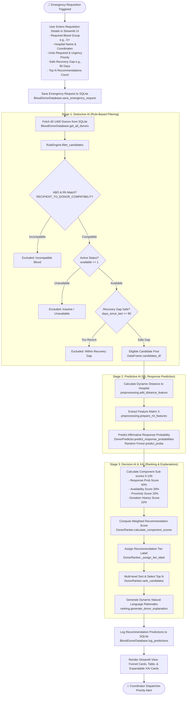

# System Architecture: AI Emergency Blood Donor Recommendation System

## 1. System Overview & Architectural Layers

The **AI-Based Emergency Blood Donor Recommendation System** is a clinical decision-support prototype designed to prioritize suitable blood donors during acute emergency blood requisitions. The system combines deterministic clinical rules, machine learning classification, and multi-criteria decision analysis into a modular, multi-tier architecture.

> **Synthetic Data Notice:** All data utilized and processed across all system layers is synthetic and generated by [`src/data_generator.py`](file:///c:/Users/USER/Documents/KDU/SEM4/group_project/New_Blood_Donor/src/data_generator.py) with a fixed seed (`seed=42`).

### Architectural Layers

```
+---------------------------------------------------------------------------------------------------------+
|                                    1. PRESENTATION LAYER (STREAMLIT UI)                                 |
|   • Dashboard (KPIs, Charts)     • Emergency Request Form      • Recommended Donors & XAI Cards         |
|   • Searchable Donor Registry    • ML Benchmarking Matrix      • Architecture & Methodology Info        |
|   File: app.py                                                                                          |
+---------------------------------------------------------------------------------------------------------+
                                                     │
                                                     ▼
+---------------------------------------------------------------------------------------------------------+
|                              2. APPLICATION & PIPELINE ORCHESTRATION LAYER                              |
|   • Form input validation        • Pipeline execution workflow • Automated end-to-end verification      |
|   Files: app.py, verify_pipeline.py                                                                     |
+---------------------------------------------------------------------------------------------------------+
        │                                            │                                            │
        ▼                                            ▼                                            ▼
+-----------------------+                  +-----------------------+                  +-----------------------+
|  3. DEDUCTIVE AI      |                  |  4. PREDICTIVE AI     |                  |  5. DECISION & XAI    |
|     (RULE ENGINE)     |                  |     (ML INFERENCE)    |                  |     (RANKING & XAI)   |
| • ABO/Rh Compatibility|                  | • Haversine Distance  |                  | • Multi-Criteria Score|
| • Active Availability |                  | • Feature Matrix Prep |                  | • Tier Categorization |
| • 90-Day Safe Gap     |                  | • P(Response) Prob    |                  | • Evidence Bullets    |
| Files:                |                  | Files:                |                  | File:                 |
| - blood_compatibility |                  | - preprocessing.py    |                  | - ranking.py          |
| - rule_engine.py      |                  | - prediction.py       |                  |                       |
|                       |                  | - train_model.py      |                  |                       |
+-----------------------+                  +-----------------------+                  +-----------------------+
        │                                            │                                            │
        └────────────────────────────────────────────┼────────────────────────────────────────────┘
                                                     │
                                                     ▼
+---------------------------------------------------------------------------------------------------------+
|                                 6. PERSISTENCE & DATA MANAGEMENT LAYER                                  |
|   • SQLite Relational Database (`data/blood_donor.db`): donors, emergency_requests, predictions         |
|   • CSV Datasets (`data/donors.csv`, `data/emergency_requests.csv`)                                     |
|   • Serialized Model Artifacts (`models/donor_response_model.pkl`, `models/model_metrics.pkl`)          |
|   Files: src/database.py, src/data_generator.py                                                         |
+---------------------------------------------------------------------------------------------------------+
```

---

## 2. Module Reference & Function Signatures

The following table documents each module within the codebase, stating its purpose and key classes/functions with their exact names and type signatures verified from the code.

| Module Path | Primary Purpose | Key Classes & Functions (Exact Signatures) |
|---|---|---|
| [`src/blood_compatibility.py`](file:///c:/Users/USER/Documents/KDU/SEM4/group_project/New_Blood_Donor/src/blood_compatibility.py) | Rule-based ABO and Rh red blood cell compatibility reasoning. | • `is_compatible(donor_group: str, recipient_group: str) -> bool`<br>• `get_compatible_donors(recipient_group: str) -> List[str]`<br>• `get_compatible_recipients(donor_group: str) -> List[str]`<br>• `get_compatibility_description(donor_group: str, recipient_group: str) -> str` |
| [`src/rule_engine.py`](file:///c:/Users/USER/Documents/KDU/SEM4/group_project/New_Blood_Donor/src/rule_engine.py) | Deterministic multi-stage candidate filtering (compatibility, active status, donation interval). | • `class RuleEngine(min_days_since_last_donation: int = 90, require_availability: bool = True)`<br>• `RuleEngine.filter_candidates(donors_df: pd.DataFrame, required_blood_group: str, enforce_donation_interval: bool = True) -> Tuple[pd.DataFrame, Dict[str, int]]`<br>• `filter_donors(donors_df: pd.DataFrame, required_blood_group: str, min_days: int = 90) -> Tuple[pd.DataFrame, Dict[str, int]]` |
| [`src/preprocessing.py`](file:///c:/Users/USER/Documents/KDU/SEM4/group_project/New_Blood_Donor/src/preprocessing.py) | Geographic Haversine distance computation and ML feature matrix extraction. | • `calculate_distance(lat1: Union[float, np.ndarray, pd.Series], lon1: Union[float, np.ndarray, pd.Series], lat2: Union[float, np.ndarray, pd.Series], lon2: Union[float, np.ndarray, pd.Series]) -> Union[float, np.ndarray, pd.Series]`<br>• `add_distance_feature(df: pd.DataFrame, hospital_lat: float, hospital_lon: float, donor_lat_col: str = "latitude", donor_lon_col: str = "longitude", output_col: str = "distance_km") -> pd.DataFrame`<br>• `prepare_ml_features(df: pd.DataFrame, feature_names: List[str] = ML_FEATURE_NAMES) -> pd.DataFrame` |
| [`src/prediction.py`](file:///c:/Users/USER/Documents/KDU/SEM4/group_project/New_Blood_Donor/src/prediction.py) | Model loading, fallback retraining, and response probability estimation. | • `class DonorPredictor(model_path: str = "models/donor_response_model.pkl")`<br>• `DonorPredictor._load_or_train_model() -> Any`<br>• `DonorPredictor.predict_response_probabilities(candidates_df: pd.DataFrame, hospital_lat: float, hospital_lon: float) -> pd.DataFrame`<br>• `predict_candidates(candidates_df: pd.DataFrame, hospital_lat: float, hospital_lon: float, model_path: str = "models/donor_response_model.pkl") -> pd.DataFrame` |
| [`src/ranking.py`](file:///c:/Users/USER/Documents/KDU/SEM4/group_project/New_Blood_Donor/src/ranking.py) | Multi-criteria recommendation scoring (MCDA), tier categorization, candidate ranking, and Explainable AI (XAI) rationale generation. | • `class DonorRanker(weights: Optional[Dict[str, float]] = None, thresholds: Optional[Dict[str, float]] = None)`<br>• `DonorRanker.calculate_component_scores(df: pd.DataFrame) -> pd.DataFrame`<br>• `DonorRanker._assign_tier_label(score: float) -> str`<br>• `DonorRanker.rank_candidates(df: pd.DataFrame, top_n: int = 5) -> pd.DataFrame`<br>• `generate_donor_explanation(donor_row: pd.Series, required_blood_group: str, hospital_name: str = "Hospital") -> Dict[str, Any]` |
| [`src/train_model.py`](file:///c:/Users/USER/Documents/KDU/SEM4/group_project/New_Blood_Donor/src/train_model.py) | Supervised ML model training, holdout evaluation (80/20), 5-fold cross-validation, benchmarking, and artifact serialization. | • `load_or_generate_dataset(data_path: str = "data/donors.csv") -> pd.DataFrame`<br>• `engineer_training_features(df: pd.DataFrame) -> Tuple[pd.DataFrame, pd.Series]`<br>• `train_and_evaluate_models(X: pd.DataFrame, y: pd.Series, random_state: int = 42) -> Dict[str, Any]`<br>• `save_trained_artifacts(results: Dict[str, Any], best_model: Any, models_dir: str = "models") -> None`<br>• `run_training_pipeline() -> Tuple[Dict[str, Any], Any]` |
| [`src/database.py`](file:///c:/Users/USER/Documents/KDU/SEM4/group_project/New_Blood_Donor/src/database.py) | SQLite database interface for querying donors, persisting emergency requisitions, logging predictions, and fetching summary metrics. | • `class BloodDonorDatabase(db_path: str = "data/blood_donor.db")`<br>• `BloodDonorDatabase._get_connection() -> sqlite3.Connection`<br>• `BloodDonorDatabase._init_tables() -> None`<br>• `BloodDonorDatabase.get_all_donors() -> pd.DataFrame`<br>• `BloodDonorDatabase.get_all_requests() -> pd.DataFrame`<br>• `BloodDonorDatabase.save_emergency_request(request_dict: Dict[str, Any]) -> None`<br>• `BloodDonorDatabase.log_predictions(predictions_list: List[Dict[str, Any]]) -> None`<br>• `BloodDonorDatabase.get_summary_metrics() -> Dict[str, Any]` |
| [`src/data_generator.py`](file:///c:/Users/USER/Documents/KDU/SEM4/group_project/New_Blood_Donor/src/data_generator.py) | Synthetic dataset generator (1,400 donor profiles) and database seeding. | • `generate_synthetic_donors(num_records: int = 1400, seed: int = 42) -> pd.DataFrame`<br>• `generate_sample_emergency_requests() -> pd.DataFrame`<br>• `save_and_init_db(data_dir: str = "data", db_path: str = "data/blood_donor.db") -> Tuple[pd.DataFrame, pd.DataFrame]` |
| [`app.py`](file:///c:/Users/USER/Documents/KDU/SEM4/group_project/New_Blood_Donor/app.py) | Streamlit web application controller, UI rendering, routing, session management, and caching. | • `get_database() -> BloodDonorDatabase`<br>• `get_predictor() -> DonorPredictor`<br>• `get_model_metrics() -> Dict[str, Any]`<br>• `render_header() -> None`<br>• `render_dashboard(db: BloodDonorDatabase) -> None`<br>• `render_emergency_request_page(db: BloodDonorDatabase, predictor: DonorPredictor) -> None`<br>• `render_recommended_donors_view(request_record: Dict[str, Any], audit_summary: Dict[str, Any], ranked_df: pd.DataFrame) -> None`<br>• `render_recommended_donors_page(db: BloodDonorDatabase, predictor: DonorPredictor) -> None`<br>• `render_donor_database_page(db: BloodDonorDatabase) -> None`<br>• `render_model_performance_page() -> None`<br>• `render_about_page() -> None`<br>• `main() -> None` |
| [`verify_pipeline.py`](file:///c:/Users/USER/Documents/KDU/SEM4/group_project/New_Blood_Donor/verify_pipeline.py) | Automated test script executing end-to-end integration verification of the complete pipeline. | • `test_emergency_workflow() -> None` |

---

## 3. Step-by-Step Emergency Request Execution Trace

When a medical coordinator fills out the emergency requisition form on Page 2 (`app.py:render_emergency_request_page`) and clicks **"🚨 FIND BEST DONORS"**, the system executes the following deterministic workflow:

```
[User Form Submit]
       │
       ▼
1. Validate Inputs & Generate Request ID (`REQ-MMDDHHMMSS`)
       │
       ▼
2. Persist Emergency Request Record ➔ `BloodDonorDatabase.save_emergency_request()`
       │
       ▼
3. Load Full Registry ➔ `BloodDonorDatabase.get_all_donors()` (1,400 records)
       │
       ▼
4. Stage 1: Deductive Rule-Based Filtering ➔ `RuleEngine.filter_candidates()`
   ├─ ABO & Rh Red Blood Cell Compatibility Matrix Match
   ├─ Active Availability Filter (`available == 1`, if enabled)
   └─ Safe Donation Recovery Gap Filter (`days_since_last_donation >= min_days_gap`)
   Returns: `candidates_df` and `audit_summary`
       │
       ▼
5. Stage 2: Machine Learning Inference ➔ `DonorPredictor.predict_response_probabilities()`
   ├─ Dynamic Haversine Distance Calculation ➔ `add_distance_feature()`
   ├─ Feature Matrix Preparation ➔ `prepare_ml_features()` (9 features)
   └─ Model Probability Estimation ➔ `RandomForestClassifier.predict_proba()`
   Returns: `predicted_df` with `distance_km` and `response_probability`
       │
       ▼
6. Stage 3: Multi-Criteria Scoring & Ranking ➔ `DonorRanker.rank_candidates()`
   ├─ Calculate 4 Normalized Sub-scores ($S_{\text{Response}}$, $S_{\text{Avail}}$, $S_{\text{Prox}}$, $S_{\text{Hist}}$)
   ├─ Compute Weighted Total Score: $0.40 S_{\text{Response}} + 0.30 S_{\text{Avail}} + 0.20 S_{\text{Prox}} + 0.10 S_{\text{Hist}}$
   ├─ Assign Recommendation Tier Label (`Highly Recommended`, `Recommended`, etc.)
   ├─ Multi-level Sort (Score DESC, Probability DESC, Distance ASC)
   └─ Truncate to Top-N Candidates (e.g., Top 5)
       │
       ▼
7. Log Prediction Results ➔ `BloodDonorDatabase.log_predictions()`
       │
       ▼
8. Store State & Render UI ➔ `render_recommended_donors_view()`
   ├─ Render 5-Step Funnel Audit Cards
   ├─ Display Ranked Candidates Data Table
   └─ Generate Dynamic XAI Explanation Cards ➔ `generate_donor_explanation()`
```

---

## 4. End-to-End Pipeline Mermaid Flowchart



---

## 5. Machine Learning Model Artifacts & Fallback Lifecycle

### Storage Location
Trained machine learning model artifacts are serialized and stored in the `models/` directory:
- [`models/donor_response_model.pkl`](file:///c:/Users/USER/Documents/KDU/SEM4/group_project/New_Blood_Donor/models/donor_response_model.pkl): Serialized best-performing classification model (Tuned Random Forest: `n_estimators=120`, `max_depth=8`, `min_samples_split=4`, `random_state=42`).
- [`models/model_metrics.pkl`](file:///c:/Users/USER/Documents/KDU/SEM4/group_project/New_Blood_Donor/models/model_metrics.pkl): Serialized benchmark dictionary containing comparative metrics (Accuracy, Precision, Recall, F1-Score, ROC-AUC, 5-Fold Cross-Validation F1 mean/std, confusion matrices, and feature importances) across Random Forest, Logistic Regression, and Decision Tree.

### Model Loading & Missing File Handling
The inference engine [`DonorPredictor`](file:///c:/Users/USER/Documents/KDU/SEM4/group_project/New_Blood_Donor/src/prediction.py#L25-L45) in `src/prediction.py` manages model loading via `_load_or_train_model()`:

```python
def _load_or_train_model(self):
    """Load trained model from disk or train fresh if not yet created."""
    if os.path.exists(self.model_path):
        try:
            return joblib.load(self.model_path)
        except Exception as e:
            print(f"Warning: Could not load model from {self.model_path}: {e}. Retraining...")
    
    # Train and save
    _, model = run_training_pipeline()
    return model
```

### Behavior When the Model File is Missing
1. If `models/donor_response_model.pkl` is missing (or corrupt), `DonorPredictor` detects the missing path or catches the loading exception.
2. It prints an informative message: `"Warning: Could not load model from models/donor_response_model.pkl: ... Retraining..."`.
3. It automatically triggers [`run_training_pipeline()`](file:///c:/Users/USER/Documents/KDU/SEM4/group_project/New_Blood_Donor/src/train_model.py#L217-L224) from `src/train_model.py`.
4. `run_training_pipeline()` executes:
   - Loads `data/donors.csv` (or generates it if missing via `save_and_init_db()`).
   - Engineers the `distance_km` training feature relative to the default reference hospital coordinates.
   - Splits the data into an 80/20 stratified train/test split (`random_state=42`).
   - Trains and evaluates Random Forest, Logistic Regression, and Decision Tree classifiers with 5-fold stratified cross-validation.
   - Saves the best model (`donor_response_model.pkl`) and benchmark metrics (`model_metrics.pkl`) to the `models/` directory.
   - Returns the fitted model instance directly to `DonorPredictor` for immediate zero-downtime inference.

---

## 6. Software Dependencies & Libraries

The system dependencies and exact version constraints are defined in [`requirements.txt`](file:///c:/Users/USER/Documents/KDU/SEM4/group_project/New_Blood_Donor/requirements.txt):

```
pandas>=2.0.0
numpy>=1.24.0
scikit-learn>=1.3.0
streamlit>=1.30.0
matplotlib>=3.7.0
seaborn>=0.12.0
joblib>=1.3.0
```

### Purpose of Each Library
- **`pandas` ($\ge 2.0.0$):** Structured tabular data manipulation, dataframe filtering, SQL query ingestion, and CSV export.
- **`numpy` ($\ge 1.24.0$):** Vectorized mathematical operations, trigonometric calculations in Haversine distance, and random sampling in data generation.
- **`scikit-learn` ($\ge 1.3.0$):** Implementation of machine learning algorithms (`RandomForestClassifier`, `LogisticRegression`, `DecisionTreeClassifier`), pipelines, scaling transformers (`StandardScaler`), evaluation metrics, and stratified cross-validation (`StratifiedKFold`).
- **`streamlit` ($\ge 1.30.0$):** Interactive clinical web application framework, form handling, layout management, session state caching, and metric rendering.
- **`matplotlib` ($\ge 3.7.0$):** Base plotting engine for donor distribution bar charts, confusion matrices, and feature importance graphs.
- **`seaborn` ($\ge 0.12.0$):** Statistical visualization library for correlation heatmaps and distribution histograms.
- **`joblib` ($\ge 1.3.0$):** High-performance disk serialization and deserialization of trained scikit-learn models and metric dictionaries.

### Python Standard Library Modules Used
- `sqlite3`: Embedded ACID-compliant relational storage engine.
- `datetime`: Requisition timestamp generation and date handling.
- `os`, `sys`: Operating system path resolution and environment configuration.
- `typing`: Type hinting and signature documentation (`List`, `Dict`, `Tuple`, `Union`, `Optional`, `Any`).
- `math`, `random`: Mathematical functions and random number generation.
- `io`: Standard output encoding wrapper for cross-platform compatibility.

---

## 7. Design Limitations Verified From the Code

The following design limitations have been verified directly from the project source code:

1. **Simplified Spherical Distance Modeling ([`src/preprocessing.py:calculate_distance`](file:///c:/Users/USER/Documents/KDU/SEM4/group_project/New_Blood_Donor/src/preprocessing.py#L27-L75)):**
   - Proximity is calculated using the spherical great-circle Haversine formula assuming a spherical Earth ($R = 6,371.0\text{ km}$).
   - The system does not integrate live road network routing APIs (e.g., OpenStreetMap, Google Directions API) or account for real-time traffic congestion, terrain barriers, or bridge closures.

2. **Simplified Serological Model ([`src/blood_compatibility.py:RECIPIENT_TO_DONOR_COMPATIBILITY`](file:///c:/Users/USER/Documents/KDU/SEM4/group_project/New_Blood_Donor/src/blood_compatibility.py#L17-L26)):**
   - Compatibility logic considers only major ABO and Rh(D) red blood cell surface antigens.
   - Minor erythrocyte antigens (e.g., Kell, Duffy, Kidd, MNS) and mandatory clinical laboratory cross-matching procedures are not modeled.

3. **Synthetic Dataset Basis ([`src/data_generator.py:generate_synthetic_donors`](file:///c:/Users/USER/Documents/KDU/SEM4/group_project/New_Blood_Donor/src/data_generator.py#L44-L168)):**
   - All donor demographics, locations, and behavioral response rates are generated programmatically with fixed random seeds (`seed=42`).
   - The system is an academic decision-support prototype and has not been trained on historical hospital transfusion service registries.

4. **Zero Variance in `contacted_before` Feature ([`src/data_generator.py:generate_synthetic_donors`](file:///c:/Users/USER/Documents/KDU/SEM4/group_project/New_Blood_Donor/src/data_generator.py#L120)):**
   - The column `contacted_before` is computed as `np.where(previous_requests > 0, 1, 0)`. Because `previous_requests` is always $\ge 2$, `contacted_before` is uniformly `1` across all 1,400 records.
   - Consequently, this feature provides zero variance and achieves a verified feature importance of `0.0000` in the trained Random Forest model.

5. **Unused `donation_history` Database Table ([`src/database.py:BloodDonorDatabase._init_tables`](file:///c:/Users/USER/Documents/KDU/SEM4/group_project/New_Blood_Donor/src/database.py#L67-L75)):**
   - The SQLite database schema creates a `donation_history` table, but no code within `src/` or `app.py` inserts, queries, or logs transactional donation records into this table (it currently contains 0 rows).

6. **Soft Fallback in Donation Interval Filtering ([`src/rule_engine.py:RuleEngine.filter_candidates`](file:///c:/Users/USER/Documents/KDU/SEM4/group_project/New_Blood_Donor/src/rule_engine.py#L95-L98)):**
   - If the safe recovery gap constraint (`days_since_last_donation >= min_days`) eliminates all candidates, the rule engine implements a silent fallback (`df_final = df_available.copy()`) to prevent empty candidate sets during emergencies, without throwing an explicit warning exception.

7. **Simulated Communication Dispatch ([`app.py:render_recommended_donors_view`](file:///c:/Users/USER/Documents/KDU/SEM4/group_project/New_Blood_Donor/app.py#L623-L630)):**
   - The action buttons ("📲 Send Emergency SMS" and "📞 Log Direct Call") simulate notifications using Streamlit status elements (`st.success`, `st.info`) rather than connecting to live SMS gateways (e.g., Twilio) or telephony APIs.
